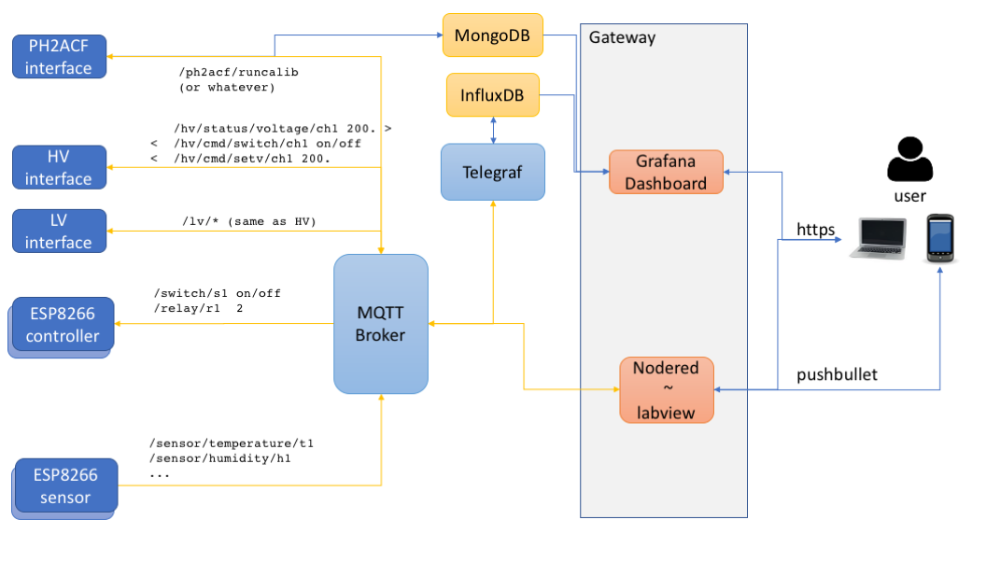

# Tracker DCS Lyon

## Overall Architecture

The system follows a microservice architecture. 
Each module in this architecture is deployed as a docker container. 

The whole architecture is described and managed as a docker-compose stack: 



**DISCLAIMER: this package is under active development, and the stack architecture
is not final.**

Users interact with the architecture through a gateway with two modules: 

* a grafana web server: monitoring dashboards
* a node-red web server: labview equivalent for the slow control and logic

The connection to these modules is secured with TLS. 

In the stack, sensors, devices, and user interfaces mostly communicate with the MQTT protocol, as they
only need to send and receive simple information, like a power-on instruction, 
or a temperature reading as a function of time. 

The system features two databases: 

* InfluxDB for time-series measurements (HV and LV status, environmental conditions)
* MongoDB for other measurements, like the output of PH2ACF (not yet implemented)

The InfluxDB database is filled via Telegraf, which listens to messages on the MQTT broker. 

The two databases are synchronized with a timestamp attached to the data. 


## Installation 

The architecture is deployed with Docker, and we use docker images built for X86_64 systems. 
Therefore, the tracker DCS stack can run on any computer with this architecture. This includes PCs and macs, but not raspberry pis, which have an ARM architecture. 
 
The software stack is described and supervised by docker-compose. 

For an introduction to docker, docker-compose, InfluxDB, and Grafana,
you could check [this blog article](https://thedatafrog.com/en/articles/docker-influxdb-grafana/)

To install, first clone this repository to your machine, and go inside: 

```
git clone https://github.com/cbernet/tracker_dcs.git
cd tracker_dcs
```

Then, install the docker engine and docker-compose for your machine as instructed below. Both tools are available in Docker Desktop.

### Docker Engine

#### Mac OS

[Install Docker Desktop on a mac](https://docs.docker.com/docker-for-mac/install/)

#### Linux

[Install the docker engine](https://docs.docker.com/engine/install/) for your platform. 

Make sure to follow the post-install instructions as well to be able to run docker without sudo. 

#### Windows

Please note the system requirements before attempting the install, 
docker desktop cannot be installed on all versions of Windows! You probably need Windows
64 bit Pro or Education, and to be an administrator of your machine. 

[Install Docker Desktop on Windows](https://docs.docker.com/docker-for-windows/install/)

### Docker-compose 

I suggest to [install docker-compose with pip](https://docs.docker.com/compose/install/#install-using-pip), the python package manager. Make sure you use python3, and that pip is connected to your version of python3. 


## Running

To start the stack in test mode : 

```
docker-compose -f docker-compose.yml -f docker-compose.dev.yml -f docker-compose.dummy.yml up -d
```

This command uses a combination of three docker-compose files : 

* [docker-compose.yml](docker-compose.yml) : production stack
* [docker-compose.dev.yml](docker-compose.dev.yml) : dev settings, which maps some additional container ports to the host. Don't do that in prod !
* [docker-compose.dummy.yml](docker-compose.dummy.yml) : dummy modules for tests, which simulate the behaviour of a high-voltage power supply, a low-voltage power supply, and an environmental sensor. 

**mqtt messages in the test stack:**

The dummy HV and LV services are handled by the same code, [trackerdcs/dummy/hv.py](trackerdcs/dummy/hv.py). 

The service emits `hv/status` with a JSON list as payload with one dictionary element per channel. Here is an example payload in case the HV has only one channel: 

```
[{"number": 0, "on": 0, "vreq": 37.0}] 
```

* number : channel number 
* on : channel on or off
* vreq : voltage   

The service can be controlled by: 

* `/hv/cmd/setv/{channel}` : Set voltage for channel 0. Payload : number.
* `/hv/cmd/switch/{channel}` : Switch channel on or off. Payload : string (on or off). TODO : not sure this works.


## Unittests 

To run the unit test suite on the host, you need to start the stack in test mode as instructed above, and then to create a suitable python environment on the host. For example, with Anaconda, create a conda environment, activate it, and install the required packages: 

```
conda create -n dcs
conda activate dcs 
pip install -r requirements.txt
```

Then run the tests : 

```
python -m unittest discover trackerdcs/
```

Please make sure all tests pass before sending a PR to this repository.


<!--
## Remote connection

Establish an ssh tunnel for the nodered and grafana ports through lyoserv: 

```
ssh -L 1880:lyovis12:1880 -L 3000:lyovis12:3000 lyoserv
```

This logs you into lyoserv, keep this connection up. 

Now, ports 1880 and 3000 of your local computer are mapped to the same ports on lyovis12, through an encrypted connection to lyoserv.

Just click the links in the next section to access these servers. 
-->

## Grafana dashboard

grafana server: [http://localhost:3000](http://localhost:3000) (use the default Grafana credentials : admin / admin)

At first, you need to set up an InfluxDB datasource like this : 


Then, import this [example dashboard](grafana/dashboards/dash_test.json) by copy/pasting the JSON configuration here : 


You can then freely modify the dashboard to suit your needs (don't forget to save it). 
Please don't hesitate to share your dashboards by : 

* exporting them as JSON
* sending a PR to this repo


## node-red

node-red server: [http://localhost:1880](http://localhost:1880)

Use the import menu to import an example flow : 


Here is a short descrition of this flow : 

* listens to the mqtt messages `/hv/status`
* extracts high voltage value for first channel from the message
* define a simple control UI

The UI can be found here : [http://localhost:1880/ui](http://localhost:1880/ui)

Again feel free to modify the UI, and don't hesitate to share your UIs by : 

* exporting them as JSON
* sending a PR to this repo


## What you should get 

Something similar to this : 


